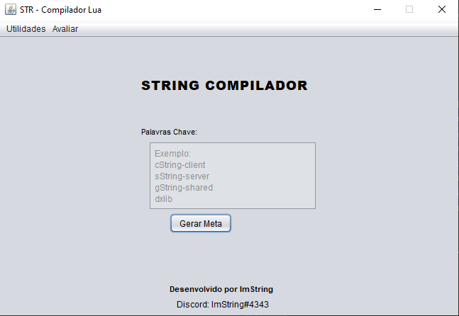

# STR_MetaCompile

## Demonstration


## Utilization
Just specify which files in the folder are server and which are client or shared.
Assuming these are these files:
```

   assets/
      images/
	     image.png
   server.lua (Type: Server)

   client.lua (Type: Client)

   config.lua (Type: Shared)
   
```

You would just put in the tab to fill in the files like this:

```
   config.lua-shared
   server.lua-server
   client.lua-client
```

## Conclusion
After completing the above process, the "application" will generate a meta.xml with the formatted information. In this way:

```xml
<meta>
	<script src="config.lua" type="shared" cache="false" />
	<script src="server.lua" type="server" />
	<script src="client.lua" type="client" cache="false" />
</meta>
```

## Contributing
Pull requests are welcome. For major changes, please open an issue first to discuss what you would like to change.

## Credits
Full credits to MisticStore
